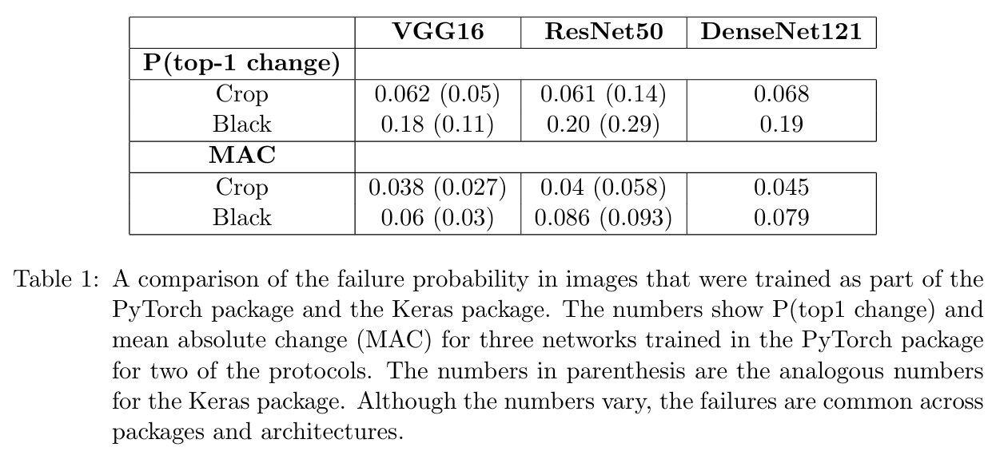
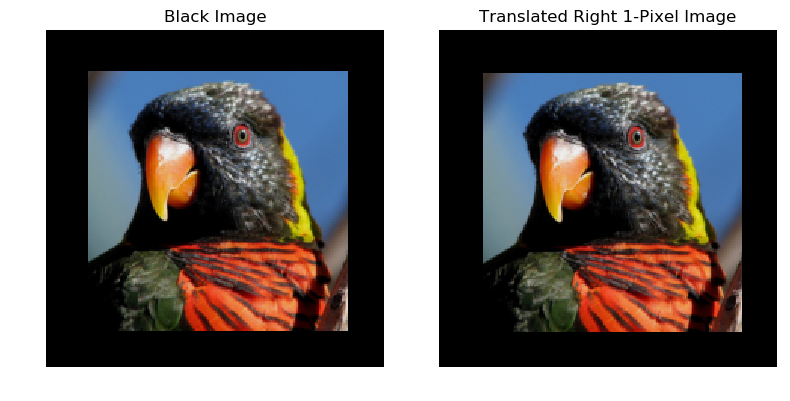
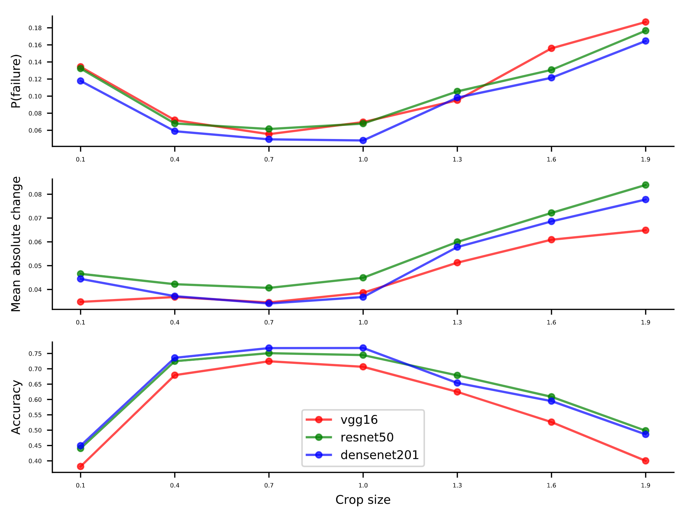

# SML_24025017

This repository reproduces the experiments from the paper *"Why Do Deep Convolutional Networks Generalize So Poorly to Small Image Transformations?"* by Aharon Azulay and Yair Weiss (2019).

## Results
### Table 1

### Reproduction Results

Here are some examples of cropped images:

 

 

Additionally, the following image summarizes the reproduction results:

## Repository Structure
- `check_translation_invariance_keras.py`: Script to check translation invariance using Keras.
- `check_translation_invariance.py`: Script to check translation invariance.
- `figure2_keras.py`: Script for generating Figure 2 using Keras.
- `inpainting_function.py`: Contains functions for inpainting experiments.
- `visualize.py`: Visualization utilities for the experiments.
- `datasets/`: Contains the dataset used for validation and experimentation.

